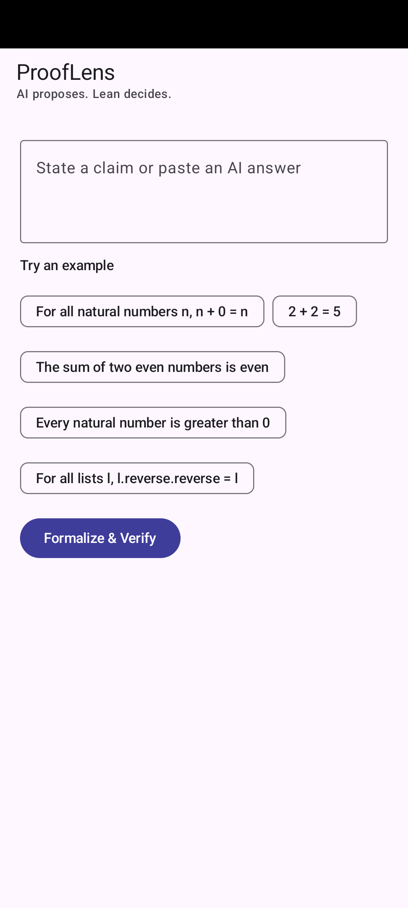
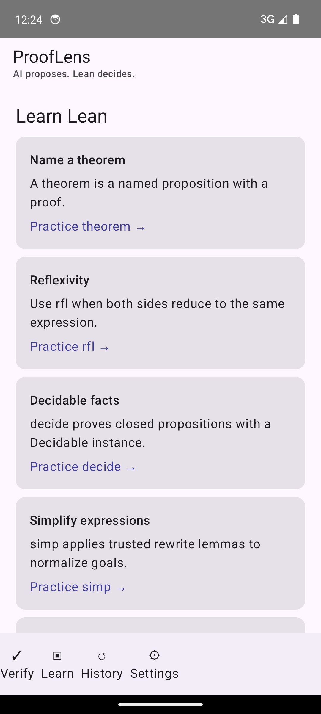
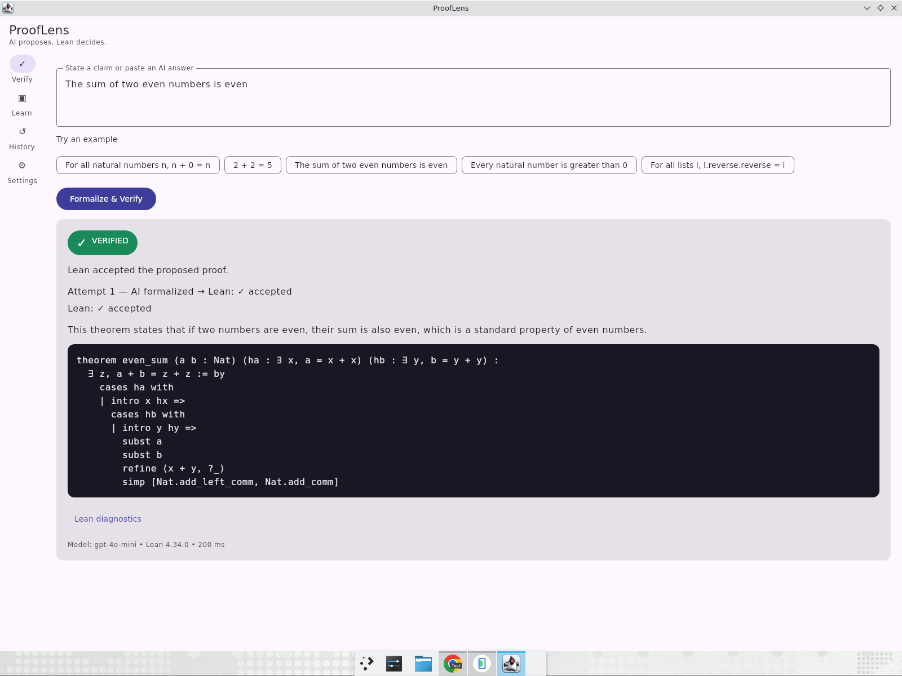

# ProofLens

ProofLens turns natural-language claims into Lean 4 proofs. AI proposes; the Lean kernel decides.

## Architecture

```text
Compose Android / Desktop JVM / Web Wasm
                 │
       shared KMP models + API
                 │ HTTP JSON
      Ktor JVM server ── Lean 4/Lake
                 └── OpenAI formalizer (optional)
```

## Run targets

Install Lean 4 with elan, then:

```bash
export PATH="$HOME/.elan/bin:$PATH"
./scripts/run-server.sh
./scripts/run-desktop.sh
./scripts/build-apk.sh
./scripts/build-web.sh
```

The app connects to the configured server by default. Enable Demo mode in Settings
to run the bundled examples without network access.
`OPENAI_API_KEY` is required for `/formalize` and `/check`; `/verify` works locally with Lean.

## Screenshots







See the [hackathon pitch](docs/PITCH.md) for the demo script, architecture,
shared-code breakdown, judging-criteria mapping, and roadmap.
